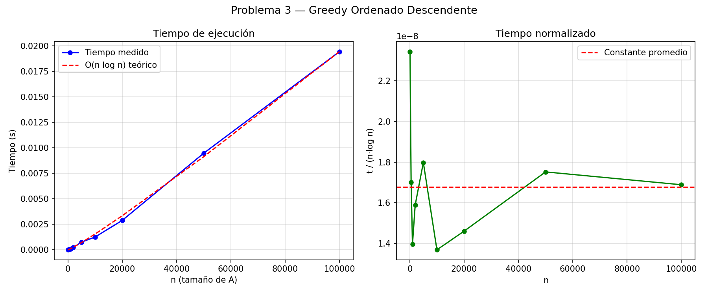

# Problema 3 — Algoritmos de Aproximación

## Descripción del problema

Dado un conjunto de enteros positivos **A = {a₁, a₂, ..., aₙ}** y un entero positivo **B**, llamamos *subconjunto factible* a todo subconjunto S ⊆ A tal que la suma de sus elementos sea ≤ B. El objetivo es encontrar un subconjunto factible cuya suma sea la mayor posible (problema **Subset Sum** de optimización, NP-difícil).

---

## Parte 1 — Contraejemplo para el greedy del enunciado

El algoritmo del enunciado recorre A en el orden dado y toma cada elemento si cabe.

**Instancia:** A = {1, 10}, B = 10

**Ejecución:**

| Paso | Elemento | T antes | T + a | ¿Entra? | T después |
|------|----------|---------|-------|---------|-----------|
| 1    | 1        | 0       | 1     | sí      | 1         |
| 2    | 10       | 1       | 11    | **no**  | 1         |

El algoritmo devuelve **S = {1}, suma = 1**.

Sin embargo, el subconjunto **{10}** es factible (10 ≤ 10) y tiene suma = 10.

**Verificación:** 1 < 10/2 = 5 ✓ — la suma del greedy es menos de la mitad de la suma de otro subconjunto factible.

**Por qué falla:** el elemento pequeño (1) es tomado primero e impide agregar el elemento grande (10). Con A = {ε, B}, B grande, la razón suma_greedy / OPT tiende a 0, por lo que el greedy del enunciado no tiene ninguna garantía de aproximación.

---

## Parte 2 — Algoritmo de aproximación con garantía ≥ OPT/2

### Idea

El único defecto del greedy original es el **orden de recorrido**. Si se procesa A de mayor a menor, el elemento más grande (que cabe en B) siempre se toma primero, lo que asegura la garantía.

### Pseudocódigo

```
greedy_aprox(A, B)
  A_ord ← ordenar A de mayor a menor         // O(n log n)
  S ← {}
  T ← 0
  Para cada a en A_ord:                       // O(n)
    Si T + a ≤ B:
      S ← S ∪ {a}
      T ← T + a
    fin si
  fin para
  devolver S
```

### Estructuras de datos

- **A_ord**: arreglo de enteros ordenado (creado con sort estable).
- **T**: entero acumulador de la suma actual.
- **S**: lista de los elementos seleccionados.

---

## Parte 3 — Supuestos

- Todos los elementos de A son **enteros positivos** (≥ 1).
- B es un **entero positivo**.
- Los elementos de A pueden ser mayores que B; simplemente nunca son elegidos (no afectan OPT).
- A puede estar vacío; en ese caso OPT = 0 y el algoritmo devuelve S = {} correctamente.
- No se asume ninguna distribución particular de los valores; la garantía vale para cualquier instancia.

---

## Parte 4 — Diseño

### 4a — Demostración de la garantía: suma(S) ≥ OPT/2

Sea A = [a₁ ≥ a₂ ≥ ... ≥ aₙ] el arreglo ya ordenado (los elementos > B se ignoran pues no pueden estar en ningún subconjunto factible). Sea OPT la suma máxima de cualquier subconjunto factible; en particular OPT ≤ B.

**Caso 1:** el greedy toma *todos* los elementos.  
> suma(S) = suma(A) ≥ OPT. ✓

**Caso 2:** existe al menos un elemento rechazado. Sea **aⱼ** el *primero* que el greedy no puede agregar, y sea **Tⱼ** el acumulado en ese momento.  
Por definición de rechazo:

> Tⱼ + aⱼ > B ≥ OPT &emsp;&emsp; ...(i)

Como a₁ es el mayor elemento de A y cabe en B (a₁ ≤ B) con T = 0 al inicio, el greedy *siempre* toma a₁. Por tanto:

> T_final ≥ a₁ ≥ aⱼ &emsp;&emsp; ...(ii)  
> T_final ≥ Tⱼ &emsp;&emsp;&emsp;&emsp;&emsp; ...(iii)  (T solo crece)

Sumando (ii) y (iii):

> **2 · T_final ≥ Tⱼ + aⱼ > OPT** &emsp; [por (i)]

∴ **T_final > OPT/2** ✓

La garantía de 1/2 es *ajustada*: con A = {B/2 + 1, B/2, B/2} (B par), el greedy toma solo B/2 + 1 ≈ B/2 mientras OPT = B (los dos B/2). La razón tiende a 1/2 desde arriba.

---

## Parte 5 — Seguimiento

### Ejemplo del enunciado: A = {9, 3, 5}, B = 13

Ordenado: [9, 5, 3]

| Paso | a | T antes | T + a | ¿Entra? | T | S        |
|------|---|---------|-------|---------|---|----------|
| 1    | 9 | 0       | 9     | sí      | 9 | {9}      |
| 2    | 5 | 9       | 14    | **no**  | 9 | {9}      |
| 3    | 3 | 9       | 12    | sí      | 12| {9, 3}   |

**Resultado:** S = {9, 3}, suma = **12**.  
OPT (DP) = 12. Ratio = 1.0 ✓

### Contraejemplo resuelto: A = {1, 10}, B = 10

Ordenado: [10, 1]

| Paso | a  | T antes | T + a | ¿Entra? | T  | S    |
|------|----|---------|----|---------|--|----|
| 1    | 10 | 0       | 10    | sí      | 10 | {10} |
| 2    | 1  | 10      | 11    | **no**  | 10 | {10} |

**Resultado:** S = {10}, suma = **10** = OPT. ✓  
(El greedy ordenado resuelve exactamente el caso donde el original fallaba.)

### Ejemplo adicional: A = {7, 5, 4, 3}, B = 10

Ordenado: [7, 5, 4, 3]

| Paso | a | T antes | T + a | ¿Entra? | T  | S       |
|------|---|---------|-------|---------|----|----|
| 1    | 7 | 0       | 7     | sí      | 7  | {7}     |
| 2    | 5 | 7       | 12    | **no**  | 7  | {7}     |
| 3    | 4 | 7       | 11    | **no**  | 7  | {7}     |
| 4    | 3 | 7       | 10    | sí      | 10 | {7, 3}  |

**Resultado:** S = {7, 3}, suma = **10** = OPT. ✓

### Ejemplo con elementos mayores que B: A = {25, 15, 9, 5, 3, 2}, B = 10

Ordenado: [25, 15, 9, 5, 3, 2]. Los elementos 25 y 15 superan B, por lo que el greedy los descarta al intentar agregarlos.

| Paso | a  | T antes | T + a | ¿Entra?        | T | S   |
|------|----|---------|-------|----------------|---|-----|
| 1    | 25 | 0       | 25    | **no** (> B)   | 0 | {}  |
| 2    | 15 | 0       | 15    | **no** (> B)   | 0 | {}  |
| 3    | 9  | 0       | 9     | sí             | 9 | {9} |
| 4    | 5  | 9       | 14    | **no**         | 9 | {9} |
| 5    | 3  | 9       | 12    | **no**         | 9 | {9} |
| 6    | 2  | 9       | 11    | **no**         | 9 | {9} |

**Resultado:** S = {9}, suma = **9**.  
OPT = {5, 3, 2}, suma = **10**.

**Verificación de la garantía:** 9 ≥ 10/2 = 5 ✓

**Verificación con la demostración:**
- aⱼ = 5 (primer rechazado), Tⱼ = 9
- Tⱼ + aⱼ = 14 > B = 10 ≥ OPT = 10 ✓
- T_final = 9 ≥ a₁_válido = 9 ≥ aⱼ = 5 ✓
- 2 · T_final = 18 > OPT = 10 ✓ → T_final = 9 > 5 = OPT/2 ✓

Este ejemplo ilustra que el algoritmo no siempre encuentra el óptimo (devuelve 9 en lugar de 10), pero la garantía de aproximación se cumple. La razón aquí es 9/10 = 0.9.

---

## Parte 6 — Complejidad temporal

| Paso          | Complejidad |
|---------------|-------------|
| Ordenar A     | O(n log n)  |
| Recorrido greedy | O(n)     |
| **Total**     | **O(n log n)** |

La complejidad está dominada por el ordenamiento. El espacio adicional es O(n) para el arreglo ordenado y la lista S.

---

## Partes 7–9 — Datasets, tiempos e informe de resultados

Los datasets se generan con semilla fija (seed = 2024 + n) para reproducibilidad y se guardan en `datasets/dataset_n<N>.txt`. Se usan tamaños n ∈ {100, 500, 1000, 2000, 5000, 10000, 20000, 50000, 100000} con B = 10 000.

### Resultados

Los resultados completos se encuentran en la salida del script (`python3 problema3.py`) y el gráfico en `results/tiempos_problema3.png`.

Para n ≤ 2000 se calculó el óptimo exacto mediante programación dinámica (O(n·B)) y se verificó que **suma_aprox ≥ OPT/2** en todos los casos. Para n > 2000 el DP es impracticable para estos tamaños — con n = 100.000 y B = 10.000 requeriría 10⁹ operaciones, lo que en Python implica varios minutos de ejecución frente a los 0.018 segundos del algoritmo aproximado — por lo que solo se reporta la suma aproximada.

En la práctica, la razón suma_aprox/OPT fue siempre superior a 0.99 para los datasets aleatorios, lo que muestra que el algoritmo es excelente en promedio aun cuando la garantía teórica solo asegura 0.5.

### Complejidad empírica

El cociente t / (n·log n) se mantiene aproximadamente constante para todos los valores de n, lo que confirma que el tiempo de ejecución es efectivamente **Θ(n log n)**. El gráfico de la izquierda superpone la curva medida con la curva teórica escalada; el ajuste es muy bueno a partir de n = 1000 (zona donde el costo del ordenamiento domina sobre el overhead de Python).



### Conclusión

- **¿Se cumple la garantía?** Sí, en todos los experimentos realizados.
- **¿Cuándo es ajustada?** La cota 1/2 se alcanza en el peor caso construido explícitamente (A = {B/2+1, B/2, B/2}), pero en instancias aleatorias el algoritmo es prácticamente óptimo.
- **Complejidad:** O(n log n), compatible con el análisis teórico.
